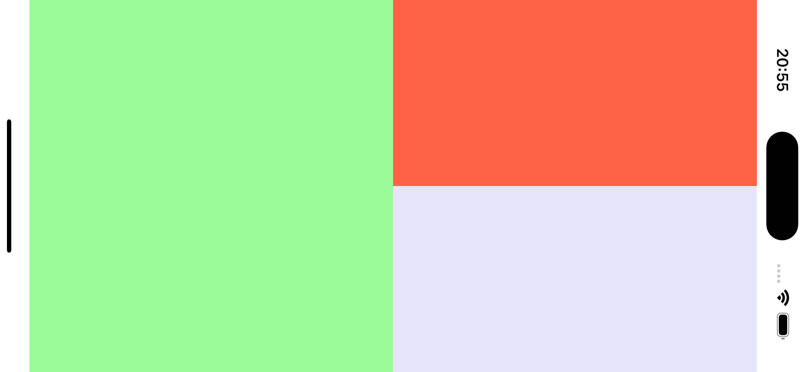
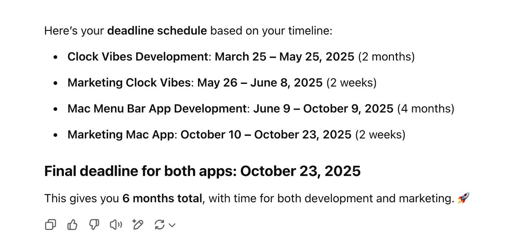
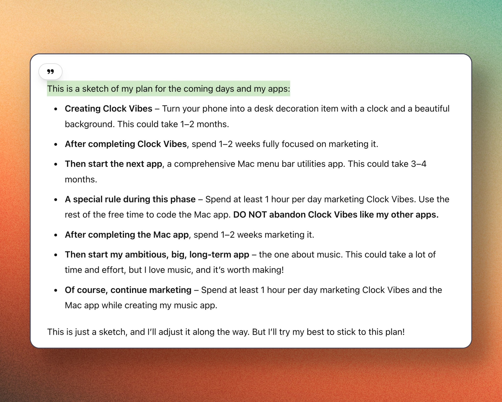
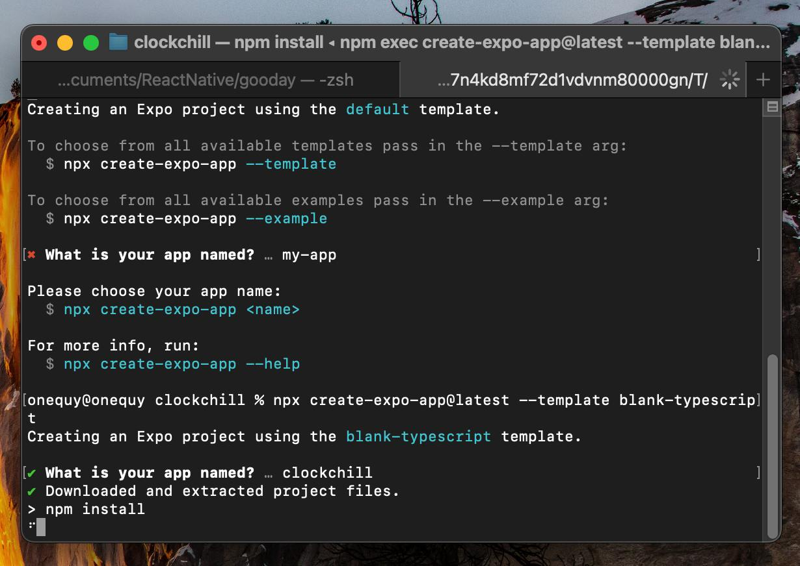

# Clock-Vibes The Journey

Enhancing focus with a customizable clock and serene backgrounds for visual appeal ✨

### Links:
- [X](https://x.com/clockvibes)
- [Facebook](https://www.facebook.com/clockvibes)
- [Journey](https://zii.one/clock-vibes-journey)
- [Tasks](https://github.com/OneQuy/onequy-public/blob/main/projects/clock-vibes/tasks.md)
- [Goals](https://github.com/OneQuy/onequy-public/blob/main/projects/clock-vibes/goals.md)
_________

## Thu Apr 3, 2025 (day 9)
- **20:20** – starting build first Testflight! failed! lol. due to Key.ts
- **20:20** – done adding very-first 5 image backgrounds
- **8:15** - 60% of adding backgrounds customization: [fb post](https://www.facebook.com/onequy/videos/1201465991362044/)
- **6:30** – started coding image background selection view.
 
## Wed Apr 2, 2025 (day 8)
- **17:00** – first time offer buy artist art

- **05:45** – first time early bird in a while woke up to cook!
 
## Tue Apr 1, 2025 (day 7)

- **22:30** - converted almost my template codebase from bare RN to Expo.
- **07:00** - created Firebase Storage.

## Mon March 31, 2025 (day 6)

- **22:40** - 20% of adding backgrounds customization: [tweet](https://x.com/onequy/status/1906737386618302699)
- **21:30** – curated first 5 images background [tweet](https://x.com/onequy/status/1906709200048427235)

- **15:00** – first glances!

    
    

- **08:00** – added first 7 fonts! completed the second item of the first release goal [tweet](https://x.com/onequy/status/1906514066870513890)

## Sun March 30, 2025 (day 5)
- **22:10** – added first 5 fonts! completed the first item of the first release goal [tweet](https://x.com/onequy/status/1906369774600532225) 

## Sat March 29, 2025 (day 4)
- **09:10** – created [FB](https://www.facebook.com/clockvibes)
- **08:43** – first release goals!

- **08:30** – Added some animated menu buttons: [tweet and demo](https://x.com/onequy/status/1905794576658653387)
 
## Fri March 28, 2025
- **15:30** – first ever 9-people in Waitlist!!! [waitlist](https://docs.google.com/spreadsheets/d/1xaxEX3RMJ-3tI46Ksa5_ZjhkFG4t4gOuFqhqrK53WRI/edit?gid=433036008#gid=433036008), [post X](https://x.com/onequy/status/1905542288581034406)
- **10:50** – first email for waitlist! [email](https://mail.google.com/mail/u/0/#label/clock+vibes/DmwnWsCQgjQpzbXKjmtlFqgphSdJvXrRSthWNVlTtpZbLrqQkFPRJsvPCQjstrmWRbvscPrwHFjG), [post BIPVN](https://www.facebook.com/groups/1569314343856132/?multi_permalinks=1823287121792185&hoisted_section_header_type=recently_seen)
- **08:00** – done basic layout for control buttons area: [tweet](https://x.com/onequy/status/1905428172558270839)

## Thu March 27, 2025
- **08:00** – done basic layout with [demo](https://x.com/onequy/status/1905062296873062582)

## Wed March 26, 2025
- **20:40** – done basic layout, 100% *vibes coding*! [tweet](https://x.com/onequy/status/1904893194581774671)

- **20:25** – first [git commit!](https://github.com/OneQuy/clockvibes/commit/0b669faebfab970b2d9dca060582e38fbb56bc25)
- **19:40** – first *vibes coding*, trying one-shot for the layout, but it fails :D

- **10:40** – first Waitlist invitation posts! [FB](https://www.facebook.com/share/p/1FQcUvwkQB/), [FB BIPVN](https://www.facebook.com/share/p/1Dc5yZHdbS/)
- **08:40** – creating [X](https://x.com/clockvibes) account
- **07:35** – kicking off [tweet!](https://x.com/onequy/status/1904694235137532186)
- **07:00** – short description: - *"A beautifully customizable digital clock with image and video backgrounds, designed for focus and aesthetics. Personalize its font, size, and position to create the perfect desktop or mobile ambiance."*
- **06:50** – creating [Waitlist](https://forms.gle/XTMwD9aQvrBLfBX78)

## Tue March 25, 2025
- **10:40** – set a deadline!

- **10:20** – sketched plan for *Clock Vibes, MenuBuddy and OnRepeat*! [ChatGPT](https://chatgpt.com/share/67e2293b-3764-8002-9ada-db35f39623fd) [FB](https://www.facebook.com/share/p/1LDf4mfvy8/?mibextid=wwXIfr)

## Mon March 24, 2025
- **22:50** – first [tweet!](https://x.com/onequy/status/1904199117225775266)
- **22:15** – initialized Expo!

- **22:00** – decided to create this app! 🚀
- **16:45** – first research! [ChatGPT](https://chatgpt.com/share/67e12997-1fe4-8002-ab76-5ac3177fa2f8)
_________

Starting point.
