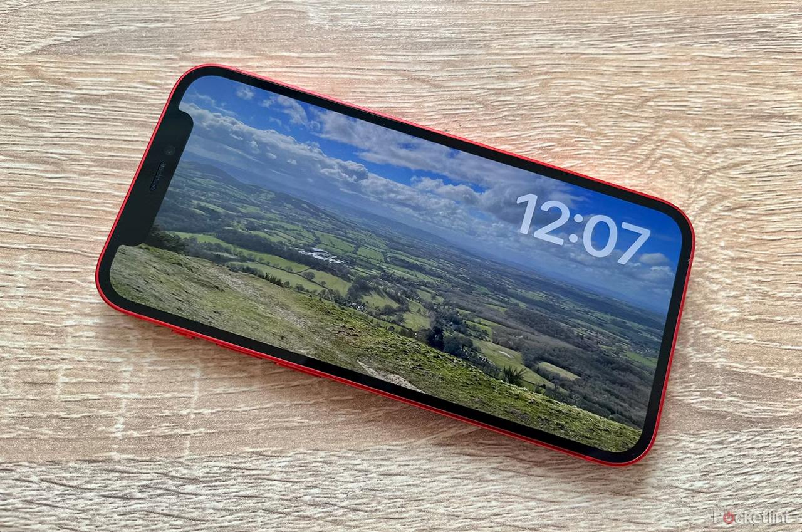

# Clock-Vibes The Journey

### Links:
- [X](https://x.com/clockvibes)
- [Journey](https://zii.one/clock-vibes-journey)
- [Tasks](https://github.com/OneQuy/onequy-public/blob/main/projects/clock-vibes/tasks.md)
- [Goals](https://github.com/OneQuy/onequy-public/blob/main/projects/clock-vibes/goals.md)
_________

## Fri March 28, 2025
- **08:00** – done basic layout for control buttons area: [tweet](https://x.com/onequy/status/1905428172558270839)

## Thu March 27, 2025
- **08:00** – done basic layout with [demo](https://x.com/onequy/status/1905062296873062582)

## Wed March 26, 2025
- **20:40** – done basic layout, 100% *vibes coding*! [tweet](https://x.com/onequy/status/1904893194581774671)

- **20:25** – first [git commit!](https://github.com/OneQuy/clockvibes/commit/0b669faebfab970b2d9dca060582e38fbb56bc25)
- **19:40** – first *vibes coding*, trying one-shot for the layout, but it fails :D

- **10:40** – first Waitlist invitation posts! [FB](https://www.facebook.com/share/p/1FQcUvwkQB/), [FB BIPVN](https://www.facebook.com/share/p/1Dc5yZHdbS/)
- **08:40** – creating [X](https://x.com/clockvibes) account
- **07:35** – kicking off [tweet!](https://x.com/onequy/status/1904694235137532186)
- **07:00** – short description: - *"A beautifully customizable digital clock with image and video backgrounds, designed for focus and aesthetics. Personalize its font, size, and position to create the perfect desktop or mobile ambiance."*
- **06:50** – creating [Waitlist](https://forms.gle/XTMwD9aQvrBLfBX78)

## Tue March 25, 2025
- **10:40** – set a deadline!

- **10:20** – sketched plan for *Clock Vibes, MenuBuddy and OnRepeat*! [ChatGPT](https://chatgpt.com/share/67e2293b-3764-8002-9ada-db35f39623fd) [FB](https://www.facebook.com/share/p/1LDf4mfvy8/?mibextid=wwXIfr)

## Mon March 24, 2025
- **22:50** – first [tweet!](https://x.com/onequy/status/1904199117225775266)
- **22:15** – initialized Expo!

- **22:00** – decided to create this app! 🚀
- **16:45** – first research! [ChatGPT](https://chatgpt.com/share/67e12997-1fe4-8002-ab76-5ac3177fa2f8)
_________

Starting point.
