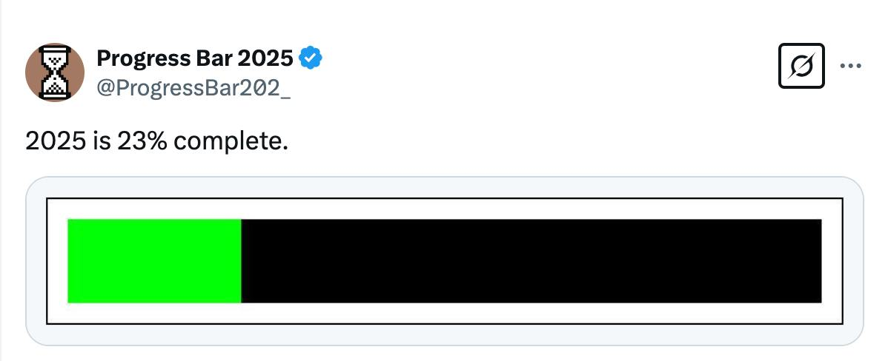

# Clock-Vibes The Journey

Enhancing focus with a customizable clock and serene backgrounds for visual appeal ✨

### Links:
- [X](https://x.com/clockvibes)
- [Facebook](https://www.facebook.com/clockvibes)
- [Journey](https://zii.one/clock-vibes-journey)
- [Tasks](https://github.com/OneQuy/onequy-public/blob/main/projects/clock-vibes/tasks.md)
- [Goals](https://github.com/OneQuy/onequy-public/blob/main/projects/clock-vibes/goals.md)
_________

## sat 31 may 25, 2025 -> now 11 june (day 67 - 78)
- still v34 IN REVIEW! CDMMM

## Fri 30 may 25, 2025 (day 66)
- android lives on play store v35!
- still v34 IN REVIEW! CDMMM

## sun - 29 may 25, 2025 -> now (day 61 - 65)
- fix bug android
- still v34 IN REVIEW! CDMMM

## sat may 24, 2025 (day 60) - DEADLINE NOOOOOOOOOOOO
- still v34 IN REVIEW! CDMMM
- 
## fri may 23, 2025 (day 59)
- still v34 IN REVIEW! CDMMM

## thu may 22, 2025 (day 58)
- still v34 IN REVIEW! CDMMM
  
## wed may 21, 2025 (day 57)
- still v34 IN REVIEW! CDMMM

## tue may 20, 2025 (day 56)
- still v34 IN REVIEW! CDMMM
  
## Mon may 19, 2025 (day 55)
- 3rd email complain
- first call complainting appstore, dev dude no idea about long time review!
- posted [another one](https://www.reddit.com/r/reactnative/comments/1kq1khm/appstore_takes_so_long_time_to_review_my_app/)
- posted [5 posts - but all removed by Reddit!!](https://github.com/OneQuy/onequy-public/blob/main/projects/clock-vibes/social-posts.md#:~:text=5%20complaints%20on%20Reddit%3A%20F*CKING%20APP%20STORE%20IS%20TAKING%20WAAAY%20TOO%20LONG%20TO%20REVIEW!%20AppDevelopers%20Side%20Project%20apps%20appdev%20reactnative) to subreddit asking WHY??
- still v34 IN REVIEW! CDMMM
  
## Sun may 18, 2025 (day 54)
- still v34 IN REVIEW! CDMMM
  
## sat may 17, 2025 (day 53)
- 2nd email complain => robot reply!!!
- still v34 IN REVIEW! CDMMM
  
## Fri May 16, 2025 (day 52)
- 2nd email complain!
- still v34 IN REVIEW! CDMMM
  
## Thu May 15, 2025 (day 51)
- still v34 IN REVIEW! CDMMM
  
## Wed May 14, 2025 (day 50)
- after almost 3 weeks, ios v34 IN REVIEW!
  
## Tue May 13, 2025 (day 49)
- the 2nd emailed to f*cking appstore! (App review status) Your case ID is 102597673797.

## Mon May 12, 2025 (day 48) - END STREAK - Code LifeStat 
- coding LifeStat for checking if submit new app got approve???
- handle logic for paywall
- canceled and resubmit build ios (8th)
  
## Sun May 11, 2025 (day 47) 
- almost done paywall UI

## Sat May 10, 2025 (day 46) 
- canceled and resubmit build ios (7th)
- continue paywall
- canceled and resubmit build ios (6th)
  

## Fri May 9, 2025 (day 45) 
- continue paywall
- canceled and resubmit build ios (5th)

## Thu May 8, 2025 (day 44) 
- canceled build ios (4th)

- start paywall
  
## Wed May 7, 2025 (day 43) 
- demo custom font size postion color: [post](https://x.com/onequy/status/1920117839530479775)
- done Zustand + fix bug save user local setting
- continue Zustand, refactor Selection

## Tue May 6, 2025 (day 42) 
- continue Zustand
  
## Mon May 5, 2025 (day 41) 
- start Zustand
- start fixing bugs
- done tracking
- requested a expedited review ios

## Sun May 4, 2025 (day 40) 
- text position + size + color!!
- 30 fonts family + font weight. all 140 fonts.

## Sat May 3, 2025 (day 39) 
- start new fonts + font weight
- **13h** - planning final release
- **12h** - done Pixabay
- **8h** - pick what quality video to show (Pexels)

## Fri May 2, 2025 (day 38) 
- **17h** - done basic video Pexels
- 
## Thu May 1, 2025 (day 37) 
- **21h** - done search Photos from Unsplash [post](https://x.com/onequy/status/1919363864296321066)
- **19h** - done Editorial from Unsplash
- **7:30** - start Video from Pexels

## Wed Apr 30, 2025 (day 36) 
- **xx:xx** - unsplash fixing UI, calling hotlink, trigger download location, credit. fix Android rejection (2x)
  
## Tue Apr 29, 2025 (day 35) 
- **8:30** - unsplash almost done!
  
## Mon Apr 28, 2025 (day 34) 

- **xx:xx** - fixed glitch blur
- **14:00** - first big full-screen time tracked! [63 min!!](https://x.com/onequy/status/1916753998683771216), [posthog event](https://us.posthog.com/project/68983/activity/explore#q=%7B%22kind%22%3A%22DataTableNode%22%2C%22full%22%3Atrue%2C%22source%22%3A%7B%22kind%22%3A%22EventsQuery%22%2C%22select%22%3A%5B%22*%22%2C%22event%22%2C%22person%22%2C%22coalesce(properties.%24current_url%2C%20properties.%24screen_name)%20--%20Url%20%2F%20Screen%22%2C%22properties.%24lib%22%2C%22timestamp%22%5D%2C%22orderBy%22%3A%5B%22timestamp%20DESC%22%5D%2C%22after%22%3A%22-24h%22%2C%22modifiers%22%3A%7B%22usePresortedEventsTable%22%3Atrue%7D%2C%22event%22%3A%22submitted_full_screen_time%22%7D%2C%22propertiesViaUrl%22%3Atrue%2C%22showSavedQueries%22%3Atrue%2C%22showPersistentColumnConfigurator%22%3Atrue%7D)

- **13:00** - first Play store rejection!

- **8:00** - to fix the bug glitch on blur
  
## Sun Apr 27, 2025 (day 33) 
- **22:00** - plugged Unsplash into the app! [post](https://x.com/onequy/status/1916506567140364563)
- **10:30** - start Unsplash!!
- **8:00** - fix pick time pomodoro slider, fix add tag of onesignal, release 2nd pre-launch version.

## Sat Apr 26, 2025 (day 32) 
- **20:00** - new XCode
- **11:00** - count for full-screen time
- **9:00** - stat, count, tracking... for pomodoro

## Fri Apr 25, 2025 (day 31) 
- **22:00** - more clarify text for pomodoro
- **8:0** - update execute timeout

## Thu Apr 24, 2025 (day 30/60) 
- **8:30** - continue updating pomodoro

## Wed Apr 23, 2025 (day 29) 
- **16:30** - second reddit [post](https://www.reddit.com/r/ProductivityApps/comments/1k5uzvg/introducing_clock_vibes_a_beautifully)
- **16:00** - first reddit [post](https://www.reddit.com/r/SideProject/comments/1k5um9p/introducing_demo_version_of_clock_vibes/)!

- **15:00** - first directory submission!

- **8:00** - conitnue pomodoro

## Tue Apr 22, 2025 (day 28) 
- **21:00** - write the 2nd email to waitlist!
- **20:00** - 43 people from 9 countries using @clockvibes today. Not bad. Still 0 revenue though :)

- **8:00** - updating pomodoro

## Mon Apr 21, 2025 (day 27) 
- **22:00** - first time live on iOS store DEMO version!

- **17:00** - updated: OnToggleVibesView 
- **10:30** - 0 DOWNLOADS FOR NOW (ANDROID) #milestone

 
- **00:09** - first time live on Android store DEMO version!

## Sun Apr 20, 2025 (day 26)
- **18:30** - cooking Pomodoro

- **8:30** - learn Netflix app

## Sat Apr 19, 2025 (day 25)
- **22:00** - cooking Pomodoro (20%?)

- **17:40** - editor inc version
- **16:00** - start cooking Pomodoro!
- **9:00** - fix version not apply + add tracking transparency permission

## Fri Apr 18, 2025 (day 24)
- **22:00** - first ios rejection! (lacking of track transparency permission)
- **17:40** - editor inc version
- **08:00** - first android submisstion!

- **08:00** - first ios submisstion!

- **7:10** - setup store
- **6:30** - final testing for firestore full-screen time
   
## Thu Apr 17, 2025 (day 23)
- **19:00** - bought new screen!

- **17:30** - done set dev (temp)
- **7:30** - start recording to firestore full-screen time!
- **7:30** - done commonize firestore

## Wed Apr 16, 2025 (day 22)

- **22:00** - starting record fullscreen time
- **20:00** - credit Unsplash.

- **8:00** - done refactor UI

## Tue Apr 15, 2025 (day 21)

🔋 **Battery Consumption Stats (My App)**

#### **🟢 Android – Regular Usage**
- **87%** at **8:52 AM** (Screen brightness: 65%)  
- **82%** at **9:26 AM** → **-5%** in **34 minutes**  
- **77%** at **9:55 AM** → **-10%** in **1 hour**  
- **66%** at **11:00 AM** → **-20%** in **2 hours**  
- **57%** at **11:55 AM** → **-30%** in **3 hours**  
> 📉 **Average Drain**: ~**-10% per hour**

--

#### **🍎 iOS – Regular Usage**
- **44%** at **8:55 AM** (Screen brightness: 80%)  
- **40%** at **9:26 AM** → **-4%** in **31 minutes**  
- **34%** at **9:54 AM** → **-10%** in **1 hour**

--

### 🎥 **Video Playback Test (Android)**
- **99%** at **9:12 AM**  
- **80%** at **10:52 AM** → **-19%** in **1h40m**  
- **70%** at **11:45 AM** → **-29%** in **2h30m**  
- **40%** at **1:45 PM** → **-59%** in **4h30m**  
> 📉 **Average Drain During Video**: ~**-13% per hour**

--

- **21:00** - start fix bug UI android + iphone SE
- **17:00** - grid for list of image, video background

- **6:50** - done premium (demo version)
- **6:30** - continueing premium, starting tracking

## Mon Apr 14, 2025 (day 20)
- **19:30** - Getting started to setup the demo mini-release on Appstore. created app on Play.

- **10:00** - Day 20 is the day I hit 20 people on my waitlist! 🙌🙌🙌

## Sun Apr 13, 2025 (day 19)
- **21:00** - done refactor RevenueCat

  
- **20:00** - refactor common files
- **10:00** - refactor tracking done
  
## Sat Apr 12, 2025 (day 18)
- **21:00** - refactor tracking
- **20:00** - done design Premium UI. start integrate RevenueCat
- **18:00** - start design Premium UI

- **17:00** - almost done revamped UI!
- **16:00** - temp removed overlay, simpling tap!
  
## Fri Apr 11, 2025 (day 17)
- remvamp UI
- UI for sound  

## Thu Apr 10, 2025 (day 16)
- **22:00** - apply a demo for RN Skia. But seem its time's up :(

## Wed Apr 9, 2025 (day 15)
- **23:00** - fixed the crash!
- **08:00** - revamped category buttons UI! also got first crash!! [X](https://x.com/onequy/status/1909783623097892956)

## Tue Apr 8, 2025 (day 14)
- **08:00** - blurred background! [X](https://x.com/onequy/status/1909413054728806659), updated paddings, revamped category UI

## Mon Apr 7, 2025 (day 13)
- **22:00** - learning Skia.

## Sun Apr 6, 2025 (day 12)
- **21:00** - added 5 sounds. done basic goal! [tweet](https://x.com/onequy/status/1908896508109611281)

## Sat Apr 5, 2025 (day 11)
- **21:45** - updated icon (blur version) app.
- **21:00** - added 5 videos: [tweet](https://x.com/onequy/status/1908536643675381807)

## Fri Apr 4, 2025 (day 10)
- **21:00** - 2nd logo generated

- **14:50** - first use before launch!! anh Trung offered a coffee for testing the app! [tweet](https://x.com/onequy/status/1908173643630436781)
- **10:00** - metrics about Battery Consumption Summary! [tweet](https://x.com/onequy/status/1907992156377055657)

- **08:50** - I love  my app BEST DEMO EVER!

- **07:30** - ChatGPT generated logo!

- **07:00** - first time on real android device #apk! [tweet](https://x.com/onequy/status/1907949384739991765)

## Thu Apr 3, 2025 (day 9)
- **22:00** – starting build first apk!
- **21:00** - first time on TF! [tweet](https://x.com/onequy/status/1907799393736208576)

- **20:20** – starting build first Testflight! failed! lol. due to Key.ts
- **20:20** – done adding very-first 5 image backgrounds
- **8:15** - 60% of adding backgrounds customization: [fb post](https://www.facebook.com/onequy/videos/1201465991362044/)
- **6:30** – started coding image background selection view.
 
## Wed Apr 2, 2025 (day 8)
- **17:00** – first time offer buy artist art

- **05:45** – first time early bird in a while woke up to cook!
 
## Tue Apr 1, 2025 (day 7)

- **22:30** - converted almost my template codebase from bare RN to Expo.
- **07:00** - created Firebase Storage.

## Mon March 31, 2025 (day 6)

- **22:40** - 20% of adding backgrounds customization: [tweet](https://x.com/onequy/status/1906737386618302699)
- **21:30** – curated first 5 images background [tweet](https://x.com/onequy/status/1906709200048427235)

- **15:00** – first glances!

    
    

- **08:00** – added first 7 fonts! completed the second item of the first release goal [tweet](https://x.com/onequy/status/1906514066870513890)

## Sun March 30, 2025 (day 5)
- **22:10** – added first 5 fonts! completed the first item of the first release goal [tweet](https://x.com/onequy/status/1906369774600532225) 

## Sat March 29, 2025 (day 4)
- **09:10** – created [FB](https://www.facebook.com/clockvibes)
- **08:43** – first release goals!

- **08:30** – Added some animated menu buttons: [tweet and demo](https://x.com/onequy/status/1905794576658653387)
 
## Fri March 28, 2025
- **15:30** – first ever 9-people in Waitlist!!! [waitlist](https://docs.google.com/spreadsheets/d/1xaxEX3RMJ-3tI46Ksa5_ZjhkFG4t4gOuFqhqrK53WRI/edit?gid=433036008#gid=433036008), [post X](https://x.com/onequy/status/1905542288581034406)
- **10:50** – first email for waitlist! [email](https://mail.google.com/mail/u/0/#label/clock+vibes/DmwnWsCQgjQpzbXKjmtlFqgphSdJvXrRSthWNVlTtpZbLrqQkFPRJsvPCQjstrmWRbvscPrwHFjG), [post BIPVN](https://www.facebook.com/groups/1569314343856132/?multi_permalinks=1823287121792185&hoisted_section_header_type=recently_seen)
- **08:00** – done basic layout for control buttons area: [tweet](https://x.com/onequy/status/1905428172558270839)

## Thu March 27, 2025
- **08:00** – done basic layout with [demo](https://x.com/onequy/status/1905062296873062582)

## Wed March 26, 2025
- **20:40** – done basic layout, 100% *vibes coding*! [tweet](https://x.com/onequy/status/1904893194581774671)

- **20:25** – first [git commit!](https://github.com/OneQuy/clockvibes/commit/0b669faebfab970b2d9dca060582e38fbb56bc25)
- **19:40** – first *vibes coding*, trying one-shot for the layout, but it fails :D

- **10:40** – first Waitlist invitation posts! [FB](https://www.facebook.com/share/p/1FQcUvwkQB/), [FB BIPVN](https://www.facebook.com/share/p/1Dc5yZHdbS/)
- **08:40** – creating [X](https://x.com/clockvibes) account
- **07:35** – kicking off [tweet!](https://x.com/onequy/status/1904694235137532186)
- **07:00** – short description: - *"A beautifully customizable digital clock with image and video backgrounds, designed for focus and aesthetics. Personalize its font, size, and position to create the perfect desktop or mobile ambiance."*
- **06:50** – creating [Waitlist](https://forms.gle/XTMwD9aQvrBLfBX78)

## Tue March 25, 2025
- **10:40** – set a deadline!

- **10:20** – sketched plan for *Clock Vibes, MenuBuddy and OnRepeat*! [ChatGPT](https://chatgpt.com/share/67e2293b-3764-8002-9ada-db35f39623fd) [FB](https://www.facebook.com/share/p/1LDf4mfvy8/?mibextid=wwXIfr)

## Mon March 24, 2025
- **22:50** – first [tweet!](https://x.com/onequy/status/1904199117225775266)
- **22:15** – initialized Expo!

- **22:00** – decided to create this app! 🚀
- **16:45** – first research! [ChatGPT](https://chatgpt.com/share/67e12997-1fe4-8002-ab76-5ac3177fa2f8)
_________

Starting point.
