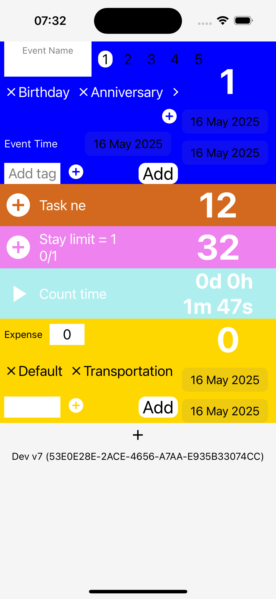
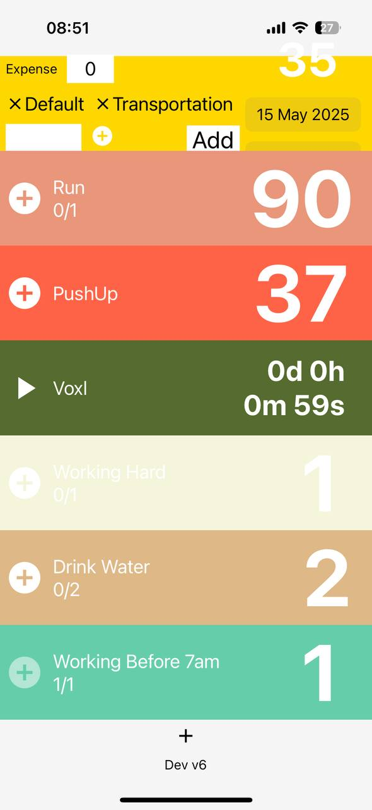

## thu 10 jul 2025 (d60)
+ no work
  
## wed 9 jul 2025 (d59)
+ no work
  
## tue 8 jul 2025 (d58)
+ update insight
  
## mon 7 jul 2025 (d57)
+ create insight
+ pick time range view
  
## sun 6 jul 2025 (d56)
+ pick time range view
  
## sat 5 jul 2025 (d55)
+ management cat/group view
+ listing view: edit item
+ listing view: view item

## fri 4 jul 2025 (d54)
+ fix: overlay not cover modal - turn to card, not modal
+ listing view: view zoom image    
  
## thu 3 jul 2025 (d53)
+ listing view: view image
+ listing view: view item
  
## wed 2 jul 2025 (d52)
+ one event view
  
## tue 1 jul 2025 (d51)
+ prepare next mini release: transitioning to yourlife project
  + temp remove login
  + add tracking
  
## mon 30 jun 2025 (d50)
+ big number temp for insights
+ prepare next mini release: transitioning to yourlife project
+ demo insight view
  
## sun 29 jun 2025 (d49)
+ listing view: update when back from modal
+ listing view: show popup & add item
  
## sat 28 jun 2025 (d48)
- [add event](https://x.com/onequy/status/1938978411416035836)
- bottom bar + action button
- listing view as home screen
  
## fri 27 jun 2025 (d47)
- listing view as home screen
- import screens
  
## thu 26 jun 2025 (d46)
- fetch data flow:    
    + fetch user startup
    + how to prevent interaction when set?
    + handle other loading?
    
## wed jun 25 2025 (d45)
- update overlay view
  
## tue jun 24 2025 (d44)
- update overlay view
- thinking about what's next?
  
## mon jun 23 2025 (d43)
- thinking about what's next?
- appstore reviewed!! but rejected (guessed) elebeant account
  
## sun jun 22 2025 (d42)
- do nothing due to stress about appstore not approve (over 24h) elebeant account
  
## sat jun 21 2025 (d41)
- submitted MemYourLife!
- met Thành to test appstore (elebeant)

## fri jun 20 2025 (d40)
+ how to prevent interaction when set?
+ handle other loading?
  
## thu jun 19 2025 (d39)
- met Thành to test appstore (elebeant) but Thành's mac broken :[[[
  
## wed jun 18 2025 (d38)
- branch: prepare-test-approve-elebeant
  
## tue jun 17 2025 (d37)
- core common controller view
+ show fetching after 1500ms
+ show popup-in-app when error
+ block interaction*
+ auto fetch (tabs screen)*
    * startup
  

## mon jun 16 2025 (d36)
+ overlay screen
+ [elebeant appstore account got approve!](https://x.com/onequy/status/1934591893507338723)

  
## sun jun 15 2025 (d35)
+ damgio + buy elebeant acc

## sat jun 14 2025 (d34)
+ adapt old code to route

## fri jun 13 2025 (d33)
+ detact bottom bar
+ done setup basic route

## thu jun 12 2025 (d32)
+ learning router, testing navigate pages

## wed jun 11 2025 (d31)
+ learning router
  
## tue jun 10 2025 (d30)
+ learning router
+ create/edit insight
+ adjust titles of create/edit insight view + add sub text explain 'all or no selected'
  
## mon jun 9 2025 (d29)
+ create/edit insight
+ adjust titles of create/edit insight view + add sub text explain 'all or no selected'
  
## sun jun 8 2025 (d28)
+ create/edit insight

## sat jun 7 2025 (d27)
+ insight view
+ design UI (5)
+ add record to supabase*
+ migrated supabase*
+ moving to supabase
  
## fri jun 6 2025 (d26)
+ moving to supabase
  
## thu jun 5 2025 (d25)
+ prevent unselect default tag
+ add important level*
+ add custom amount/value*
+ fix no tag selected when switch cat/group*
  
## wed jun 4 2025 (d24)
+ select tag default at init
+ button go to management
+ add category/group/tags (with check default) to record
+ tag/cate/group management
+ adding cate/group management
  
## tue jun 3 2025 (d23)
- adding cate/group management
  
## mon jun 2 2025 (d22)
- fix compile errors and can back to add event now
- breaking change: focus life event. 
  
## sun jun 1 2025 (d21)
- breaking change: focus life event! (5)
    + custom amount/value (5)
    
## sat may 31 2025 (d20)
- creat stat UI common
- done delete stat: life-event
- done delete stat: count-up-time
- done delete stat: money-manager
- done delete stat: count-up
- prioritizing tasks

## fri may 30 2025 (d19) - v111
**#special #v111**
- pivotted new plan: focus appstore approvval, 3 apps: clock vibes, life stat, on-repeat.
- done filter for life event: level, date, tag
  
## thu may 29 2025 (d18)
- fix pagination firestore
- filter for life event: level, date

## wed may 28 2025 (d17)
- fix bug count up (due to start value)
- view zoom a image/video for life event
  
## sun, mon, tue may 25, 26, 27, 2025 (d14, d15, d16)
- edit life event
- view list of life event
- view a item of live event

## sat may 24, 2025 (d13)
- basic show list of life events
- start view list of life event
- done add description, media for count up
  
## fri may 23, 2025 (d12)
- start add description, media for count up
- done basic chart (back view) for money

## thu may 22, 2025 (d11)
- doing chart
  
## wed may 21, 2025 (d10)
- start chart

## tue may 20, 2025 (d9)
- start compress media
- revamping UI, save time range, new themes
  
## mon may 19, 2025 (d8)
- revamping UI
  
## sun may 18, 2025 (d7)
- revamping UI
- 
## sat may 17, 2025 (d6)
- start revamp UI
- first uploaded to appstore! (just for checking if the appstore really works or not for clockvibes) [post](https://x.com/onequy/status/1923571725960347818)

- trying upload store for check they approve or do something?

## Fri may 16, 2025 (d5)
- done basics: money manager, count up, count time up, life event

## Thu may 15, 2025 (d4)
- start life event 
- done money manager (damm basic)

- edit UI draft count up, count time up

## wed may 14, 2025 (d3)
- start money man

- first on real phone! [post](https://x.com/onequy/status/1922557467914805526)

  

## Tue May 13, 2025  (d2)
- done count up, count time up
- fix FirebaseDatabase
  
## Mon May 12, 2025  (d1)
- **22:23** inited UI [count up](https://i.ibb.co/rfpZbkHZ/image.png)

- type defines for stat item
  
- **18:00** inited expo

- **17:30** tired of Clock Vibes appstore review so started this for coping!

_________

Starting point. [X post](https://x.com/onequy/status/1921875274766893277)
